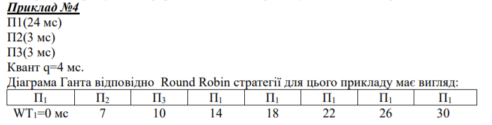

# Лабораторная работа №3: Исследование дисциплин обслуживания заявок при ограниченных ресурсах

##### Алгоритм работы при исполнении лабораторной работы: 
**«Ротационная» стратегия планирования**
**RR-ROUND ROBIN**

Round Robin стратегия применяется в системах распределения времени. В RR
определяется небольшой отрезок времени, называемый квантом времени (10..100 мс). очередь
готовых заявок рассматривается как кольцевая. Заявки циклически перемещаются по очереди,
получая CPU на некоторое время, что равный одному кванта. Новый процесс добавляется в
хвост очереди. Если процесс не завершился в пределах выделенного ему кванта времени, то
его работа принудительно прерывается, и он перемещается в хвост очереди.

Пример работы данного алгоритма
##### Пример работы:

1) 

Создание очереди заявок с определенными приоритетами.

2) 

Обработка заявок за определенный отрезок кванта.

3) 

Пример очереди где время на обработку заявки больше, чем размер кванта.

4) 

Пример расширения кванта.

**График**

Время ожидания выполнения задачи относительно её приоритета. На данном графике можно увидеть,
что каждая задача имеет некий приориет. Следущаю задача должна дождаться окончания предыдущей. Основные величины при построении графика, ось х - приоритет задачи, у - время ожидания, которое нужно прождать задаче до начала её выполнения. 
